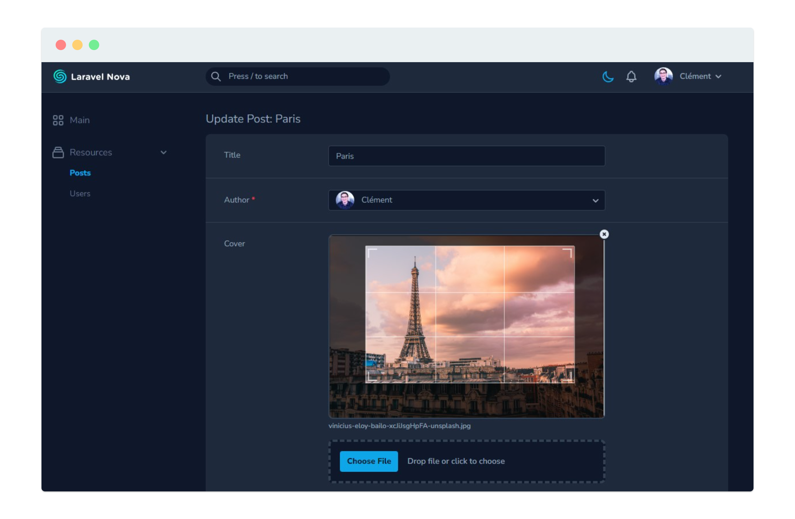

<h1 align="center">Nova Advanced Image Field</h1>

<p align="center">
  <a href="https://github.styleci.io/repos/156091175?branch=2.x"></a>
  <a href="https://packagist.org/packages/ctessier/nova-advanced-image-field"></a>
  <a href="https://packagist.org/packages/ctessier/nova-advanced-image-field"></a>
  <a href="https://packagist.org/packages/ctessier/nova-advanced-image-field"></a>
</p>

<p align="center"><i>An advanced image field for Nova allowing you to upload, crop and resize images</i></p>

This package is built on top of the native Nova image field. It uses [Advanced Cropper](https://advanced-cropper.github.io/vue-advanced-cropper/) to show a cropper on the frontend, and [Intervention Image](http://image.intervention.io) to process the image on the backend.



## Requirements

<table>
  <thead>
    <tr>
      <th>Version</th>
      <th>PHP</th>
      <th>Nova</th>
      <th>GD (default)</th>
      <th>Imagick</th>
    </tr>
  </thead>
  <tbody>
    <tr>
      <td>1.x</td>
      <td>>=7.1</td>
      <td>2 or 3</td>
      <td rowspan=2>>=2.0</td>
      <td rowspan=2>>=6.5.7</td>
    </tr>
    <tr>
      <td>2.x</td>
      <td>>=7.3</td>
      <td>4</td>
  </tbody>
</table>

See [Intervention requirements](https://image.intervention.io/v2/introduction/installation) for more details.

## Getting started

Install the package into a Laravel application with Nova using Composer:

```bash
composer require ctessier/nova-advanced-image-field
```

If you want to use Imagick as the default image processing library, follow the [Intervention documentation for Laravel](https://image.intervention.io/v2/introduction/installation#laravel).
This will provide you with a new configuration file where you can specify the driver you want.

## Code examples

`AdvancedImage` extends from `Image` so you can use any methods that `Image` implements. See the documentation [here](https://nova.laravel.com/docs/3.0/resources/file-fields.html).

```php
// Show a cropbox with a fixed ratio
AdvancedImage::make('Photo')->croppable(16/9),

// Resize the image to a max width
AdvancedImage::make('Photo')->resize(1920),

// Override the image processing driver for this field only
AdvancedImage::make('Photo')->driver('imagick'),
```

To display the image as a rounded avatar, use the `AdvancedAvatar` class or the `rounded` method:

```php
AdvancedAvatar::make('Avatar')->croppable(),
AdvancedImage::make('Avatar')->croppable()->rounded(),
```

## API

### `driver(string $driver)`

Override the default driver to be used by Intervention for the image manipulation.

```php
AdvancedImage::make('Photo')->driver('imagick'),
```

### `croppable([float $ratio])`

Specify if the underlying image should be croppable.

If a numeric value is given as a first parameter, it will be used to define a fixed aspect ratio for the crop box.

```php
AdvancedImage::make('Photo')->croppable(),
AdvancedImage::make('Photo')->croppable(16/9),
```

### `resize(int $width = null[, int $height = null])`

Specify the size (width and height) the image should be resized to.

```php
AdvancedImage::make('Photo')->resize(1920),
AdvancedImage::make('Photo')->resize(600, 400),
AdvancedImage::make('Photo')->resize(null, 300),
```

_Note: this method uses [Intervention Image `resize()`](https://image.intervention.io/v2/api/resize) with the upsize and aspect ratio constraints._

### `autoOrientate()`

Specify if the underlying image should be orientated. It will rotate the image to the orientation specified in Exif data, if any.

This can be mandatory in some cases for the cropper to work properly.

```php
AdvancedImage::make('Photo')->autoOrientate(),
```

_Note: PHP must be compiled in with `--enable-exif` to use this method. Windows users must also have the mbstring extension enabled. See [the Intervention Image documentation](https://image.intervention.io/v2/api/orientate) for more details._

### `quality(int $quality)`

Specify the resulting quality of the transformed image.

This only applies to JPG format as PNG compression is lossless. The value must range from 0 (poor quality, small file) to 100 (best quality, big file).

```php
AdvancedImage::make('Photo')->resize(600, 400)->quality(95),
```

_Note: the quality will be passed to the [Intervention Image `save()`](https://image.intervention.io/v2/api/save) method._

### `convert(string $format)`

Specify the desired output format.

```php
AdvancedImage::make('Photo')->convert('webp'),
```

_Note: See [Intervention Image `encode()`](https://image.intervention.io/v2/api/encode) for more details, including the list of allowed formats._